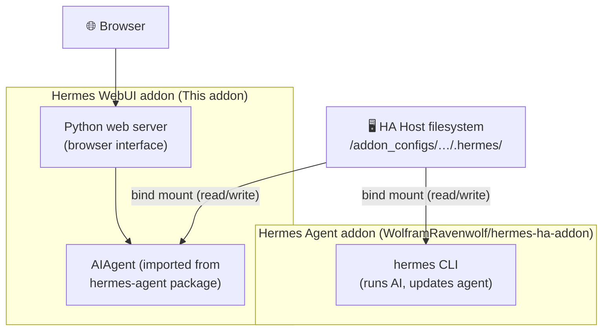

# Hermes WebUI Home Assistant Addon

HA Addon for [Hermes WebUI](https://github.com/nesquena/hermes-webui) — a lightweight, dark-themed browser interface for [Hermes Agent](https://hermes-agent.nousresearch.com/).

## Installation
1. Add this addon repository to Home Assistant (`https://github.com/aminedjeghri/ha-addons`)
2. Install the "Hermes WebUI" addon
3. Configure your settings (see below)
4. Start the addon
5. Open the Web UI from the addon page

## Configuration

| Option               | Default              | Description                                                                                                                                                       |
|----------------------|----------------------|-------------------------------------------------------------------------------------------------------------------------------------------------------------------|
| `hermes_home`        | *(auto-discovered)*  | Path to the `.hermes` data directory of your existing Hermes Agent addon. Leave empty to auto-discover any `*_hermes_agent` addon, or fall back to isolated mode. |
| `password`           | *(unset)*            | Optional password to protect the web UI. Strongly recommended if exposed beyond localhost.                                                                        |

For the full list of upstream environment variables see the [official configuration reference](https://github.com/nesquena/hermes-webui#overrides-only-needed-if-auto-detection-misses).

This addon is recommended to be used with the [Hermes Agent HA addon](https://github.com/WolframRavenwolf/hermes-ha-addon).

### Shared mode (recommended)

If you are running the [Hermes Agent HA addon](https://github.com/WolframRavenwolf/hermes-ha-addon), the default directory will be used. For example `/addon_configs/0a6523c6_hermes_agent/.hermes`). The WebUI will share the same config, API keys, profiles, memory, and skills as the agent — no separate setup needed.
You will go through the onboarding wizard to configure providers on first start, most fields will be autofilled.


Both addons run as separate containers but mount the **same `.hermes` directory** from the HA host filesystem. The WebUI imports the agent's Python package directly from that shared directory — there is no duplication and no syncing needed.



> **Updating the agent:** Always update the Hermes Agent from the **Hermes Agent addon** (via its terminal/CLI), not from the update button inside this WebUI. Both addons share the same files on disk, so any update done in the Agent addon is instantly visible here too.

### Isolated mode

It will run the WebUI with its own independent data in `/data/hermes`. You will go through the onboarding wizard to configure providers on first start.

## Access

Once started, open the Web UI via the **Open Web UI** button on the addon page, or navigate to:

```
http://YOUR_HA_IP:8787
```

## Notes

- Only `amd64` and `aarch64` architectures are supported (no `armv7`).
- On first start, the onboarding wizard will guide you through provider/model setup.
