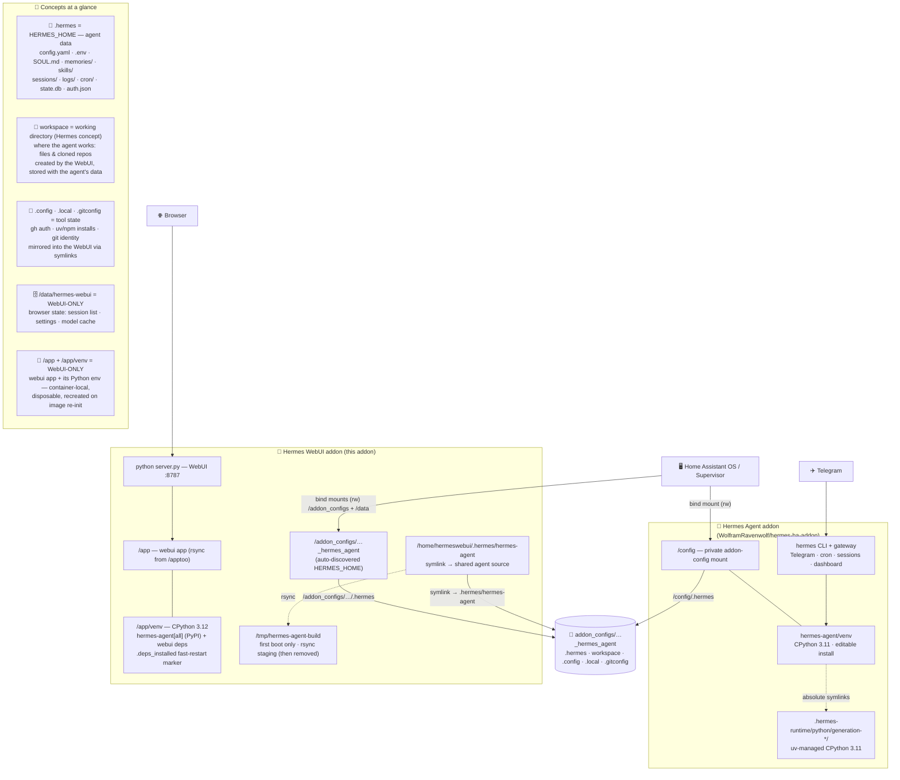

# Hermes WebUI Home Assistant Addon

HA Addon for [Hermes WebUI](https://github.com/nesquena/hermes-webui) — a lightweight, dark-themed browser interface for [Hermes Agent](https://hermes-agent.nousresearch.com/).

## Installation
1. Add this addon repository to Home Assistant (`https://github.com/aminedjeghri/ha-addons`)
2. Install the "Hermes WebUI" addon
3. Configure your settings (see below)
4. Start the addon
5. Open the Web UI from the addon page

## Configuration

| Option               | Default              | Description                                                                                                                                                       |
|----------------------|----------------------|-------------------------------------------------------------------------------------------------------------------------------------------------------------------|
| `hermes_home`        | *(auto-discovered)*  | Path to the `.hermes` data directory of your existing Hermes Agent addon. Leave empty to auto-discover any `*_hermes_agent` addon, or fall back to isolated mode. |
| `password`           | *(unset)*            | Optional password to protect the web UI. Strongly recommended if exposed beyond localhost.                                                                        |

For the full list of upstream environment variables see the [official configuration reference](https://github.com/nesquena/hermes-webui#overrides-only-needed-if-auto-detection-misses).

This addon is recommended to be used with the [Hermes Agent HA addon](https://github.com/WolframRavenwolf/hermes-ha-addon).

### Shared mode (recommended)

If you are running the [Hermes Agent HA addon](https://github.com/WolframRavenwolf/hermes-ha-addon), this addon auto-discovers it and mounts its config directory. For example: `/addon_configs/0a6523c6_hermes_agent/`. The WebUI will share the same config, API keys, profiles, memory, and skills as the agent — no separate setup needed.

Both addons run as **separate Docker containers** but access the **same directories** from the HA host filesystem via volume mounts. There is no duplication and no syncing needed.

### Architecture

Two **separate Docker containers** share the **same directories** on the HA host
(`/addon_configs/<slug>_hermes_agent/`) via volume mounts — no duplication, no syncing.
The WebUI mirrors the agent's environment on every start (see [Shared environment](#shared-environment)).



#### Venv handling

| | Hermes Agent addon | Hermes WebUI addon |
|---|---|---|
| Python runtime | CPython 3.11, **uv-managed** in `.hermes-runtime/python/generation-*/` (inside the shared checkout) | CPython 3.12 from the image |
| Virtual env | `.hermes/hermes-agent/venv/` — **on shared disk**, **editable install** (the agent can read/modify its own code) | `/app/venv/` — **container-local**, disposable (recreated when the image re-initialises) |
| How deps are installed | editable, from the shared git checkout | `hermes-agent[all]` **from PyPI** + `requirements.txt` + `hindsight-client`, guarded by the `.deps_installed` marker |
| Path resolution | venv symlinks are absolute → `/config/.hermes/…` (resolves in the agent container) | the shared venv's symlinks point at `/config/.hermes/…`, which **does not exist** here — so the WebUI never uses the agent's venv |

> The two containers reach the *same* `.hermes` directory through **different mount
> points**: `/config/.hermes` in the agent addon, `/addon_configs/<slug>_hermes_agent/.hermes`
> in the WebUI. The shared venv + uv runtime are built for the agent's path. Always run
> `hermes` (updates, CLI) from the **agent addon**, not from the WebUI container.

#### Why two virtual environments?

The two containers share the **code** (the git checkout) and the **data**
(`HERMES_HOME`) — never their **environment**:

- **Agent addon** — the engine runs **from source**: `hermes-agent` is installed
  **editable** (`uv pip install -e .[all]`) into `.hermes/hermes-agent/venv/`.
  Editable means the package is not copied into `site-packages`: Python imports
  load straight from the git checkout, so the agent can read and modify its own
  code (self-modifiable source), and a `git pull` takes effect immediately.
- **WebUI addon** — the server imports Hermes **in-process** (the `AIAgent`), so
  its own venv `/app/venv` (CPython 3.12) installs `hermes-agent[all]` **from
  PyPI**: a stable, self-contained, disposable snapshot. The agent's venv cannot
  be used here (its absolute symlinks target `/config/.hermes/…`, a path that
  only exists inside the agent container) and should not be shared anyway —
  virtual environments are isolated by design, and the WebUI must keep working
  even without the agent addon (isolated mode).

#### Command line (CLI) in this addon

`run.sh` adds `/app/venv/bin` to `PATH`, so the `hermes` CLI is available
directly in this container (`hermes doctor`, `hermes config get`, `hermes mcp`,
…) and operates on the shared `HERMES_HOME`, exactly like on the agent addon.

> **Never run `hermes update` / `/update` from this container.** It performs a
> `git pull` on the shared checkout followed by an editable reinstall — into a
> venv that is wiped at the next image re-init — and could conflict with the
> agent's editable install. Always update from the **Hermes Agent addon**. This
> container's PyPI version re-aligns automatically on each add-on update (the
> init script reinstalls the latest release); check drift with `hermes --version`
> in both containers.

#### Where files live on the HA host

| Host path | Agent addon | WebUI addon | Contents |
|---|---|---|---|
| `addon_configs/<slug>_hermes_agent/.hermes` | `/config/.hermes` | `…/.hermes` via `HERMES_HOME` | `config.yaml`, `.env`, `SOUL.md`, `memories/`, `skills/`, `sessions/`, `logs/`, `state.db`, `cron/`, `plugins/`, `hermes-agent/` |
| `…/.hermes/hermes-agent` | `/config/.hermes/hermes-agent` | symlink `/home/hermeswebui/.hermes/hermes-agent` | git checkout + `venv/` + `.hermes-runtime/` |
| `…/workspace` | `/config/workspace` | `HERMES_WEBUI_DEFAULT_WORKSPACE` | working files, cloned repos (e.g. this one) |
| `…/.config` | `/config/.config` | symlink `/root/.config` (`XDG_CONFIG_HOME`) | `gh` auth, npm/pip tool config |
| `…/.local` | `/config/.local` | symlink `/root/.local` (`XDG_DATA_HOME`) | uv/npm installs, local binaries |
| `…/.gitconfig` | `/config/.gitconfig` | symlink `/root/.gitconfig` | git identity + credential helper |
| `/data/hermes-webui` | — | `/data/hermes-webui` | WebUI state (sessions, settings, model cache) |

> **HA Core config access is provided through APIs instead: the **Supervisor API**
> (`http://supervisor`, authenticated with the auto-injected `SUPERVISOR_TOKEN`)
> for add-on and Core logs, and the **HA REST/WebSocket API** for entity states
> and automation configuration.

> **Updating the agent:** Always update the Hermes Agent from the **Hermes Agent addon** (via its terminal/CLI), not from the update button inside this WebUI. Both addons share the same files on disk, so any update done in the Agent addon is instantly visible here too.

### Shared environment

In shared mode, the webui container mirrors the hermes_agent's environment on every start. The following are shared automatically — **no manual setup required**:

| What                          | How                                             | Details                                              |
|-------------------------------|-------------------------------------------------|------------------------------------------------------|
| **Agent data** (`.hermes/`)   | `HERMES_HOME` env var                           | Profiles, sessions, memory, skills, API keys         |
| **Tool config** (`.config/`)  | symlink + `XDG_CONFIG_HOME`                     | `gh` auth, npm, pip, and all XDG-compliant tools     |
| **Local data** (`.local/`)    | symlink + `XDG_DATA_HOME`                       | uv-installed packages, local binaries, app data      |
| **Git config** (`.gitconfig`) | symlink                                         | User config, credential helper (`gh auth setup-git`) |
| **Workspace** (`workspace/`)  | auto-created + `HERMES_WEBUI_DEFAULT_WORKSPACE` | Where you want to work (for example cloned repos)    |

> **Note:** These symlinks and env vars are set at container startup. If the hermes_agent hasn't booted yet (dirs don't exist), they are silently skipped and created on the next restart.


### Isolated mode

It will run the WebUI with its own independent data in `/data/hermes`. You will go through the onboarding wizard to configure providers on first start.

## Access

Once started, open the Web UI via the **Open Web UI** button on the addon page, or navigate to:

```
http://YOUR_HA_IP:8787
```

## Notes

- Only `amd64` and `aarch64` architectures are supported (no `armv7`).
- On first start, the onboarding wizard will guide you through provider/model setup.
